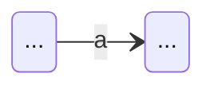
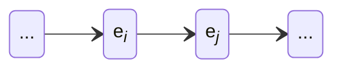
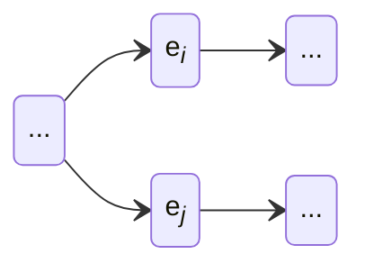
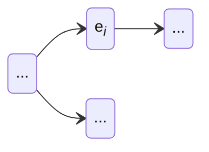
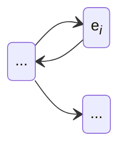
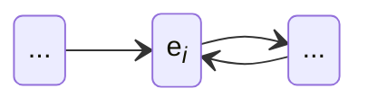

# Simple Regular Expression Interpreter in Mojo

## What is This

Inspired by [Russ Cox's series of articles](https://swtch.com/~rsc/regexp/) on regular expressions.

## NFA Diagrams for Basic Blocks of Regular Expressions

### $a$ (Any Literal Character)

### $e_ie_j$ (Expression Concatenacion)

### $e_i|e_j$ (Expression Alteration)

### $e?$ (Repetition Zero or One Time)

### $e*$ (Repetition Zero or More Times)

### $e+$ (Repetition One or More Times)

